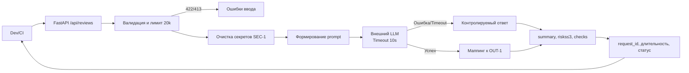

# ADR: решение для первого рабочего сценария

- Статус: accepted
- Дата: 2026-09-11
- Ответственные: команда бэкенда; владелец модуля ReviewService

## Контекст

Учебный сервис на FastAPI принимает PR-diff через POST /api/reviews, передаёт его в ReviewService, который вызывает внешний LLM и возвращает результат. Требуется обеспечить безопасное и предсказуемое AI-ревью диффов. В AS IS отсутствуют валидация, лимит размера, очистка секретов, таймаут LLM и структурированный ответ.

## Решение

1) Типизированный контракт API: POST /api/reviews принимает JSON с полем diff: string; при отсутствии/неверном типе → 422.
2) Ограничение размера diff (API-1): >20 000 символов → 413.
3) Очистка секретов (SEC-1): перед отправкой в LLM редактировать токены/пароли/приватные ключи.
4) Таймаут и контролируемые ошибки LLM (REL-1): timeout 10 секунд; ошибка/таймаут преобразуется в контролируемый ответ.
5) Структурированный ответ (OUT-1): вернуть {summary, risks≤3[file,line,evidence,risk], checks[]}.
6) Безопасное логирование (OBS-1): логировать только request_id, длительность, статус; не логировать diff/ответ модели.

## Рассмотренные альтернативы

| Альтернатива | Почему не выбрали сейчас |
|---|---|
| Отсутствие лимита и полная передача diff в LLM | Риск утечки секретов и непредсказуемых затрат/таймаутов; нарушает SEC-1 и API-1 |
| Свободный текст ответа без схемы | Невозможно программно обрабатывать результаты; нарушает OUT-1 |
| Логирование полного запроса и ответа | Риск утечек PII/секретов и несоответствие OBS-1 |

## Последствия и главный риск

- Положительные последствия: предсказуемые коды ошибок (422/413), контролируемые таймауты LLM, структурный выход, снижение риска утечки секретов.
- Ограничения: сокращение контекста diff при редактировании может ухудшить качество ревью; лимит 20 000 может требовать разбиения диффов.
- Главный риск: ложноположительная или ложноотрицательная очистка секретов, искажающая контекст ревью.
- Как проверим риск: юнит-тесты на набор шаблонов секретов; ручная проверка на тестовом diff; интеграционный прогоны с mock LLM.

## Архитектурная схема

## Как использовали AI

- Для чего: структурировать решение, сравнить альтернативы и зафиксировать последствия
- Тип промпта: master prompt (P1-02)
- Строка в [`prompts.md`](prompts.md): P1-02
- Что проверили и исправили сами: корректность ссылок на правила, синтаксис Mermaid
