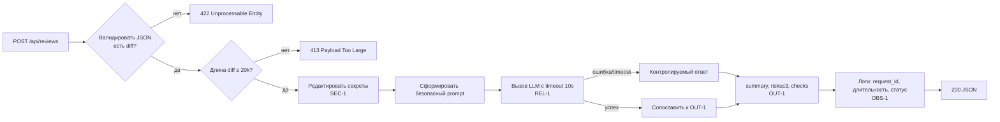

# Анализ процесса: AS IS и TO BE

## AS IS

Событие: разработчик или CI-бот делает POST /api/reviews с JSON-телом.

Участники: Пользователь (Dev/CI), FastAPI, ReviewService, внешний LLM.

Шаги:
- Пользователь отправляет произвольный JSON; поле "diff" может отсутствовать.
- FastAPI-роут извлекает payload["diff"]; при отсутствии ключа — KeyError → 500.
- ReviewService формирует свободный промпт без удаления секретов и без лимита длины.
- Вызывается LLM.generate без таймаута/ретраев; ошибка/задержка → 500/подвисание.
- Ответ API — {"comment": str} без структуры.

Проблемы AS IS: нарушаются SEC-1, API-1, REL-1, OUT-1, OBS-1.

## TO BE

Один запрос проходит валидатор, фильтр размера, редактирование секретов и контролируемый вызов LLM. Ответ структурирован per OUT-1, логирование безопасно per OBS-1.

## Разница

| Что меняется | AS IS | TO BE | Как проверим изменение |
|---|---|---|---|
| Валидация тела | payload["diff"] без схемы | 422 при отсутствии/нестроке diff | Интеграционный тест: тело без diff → 422 |
| Лимит размера | Отсутствует | 20 000 символов → 413 | Интеграционный тест с >20 000 символов |
| Очистка секретов | Отсутствует | Редактирование токенов/паролей/ключей | Юнит-тест на функцию редактирования |
| Таймаут LLM | Нет | 10 с и контролируемая ошибка | Интеграционный тест с заглушкой таймаута |
| Формат ответа | {"comment": str} | OUT-1: summary, risks≤3, checks | Юнит-тест парсинга структуры |
| Логи | Могут содержать diff/ответ | Только request_id, длительность, статус | Ревью + проверка логов |

## Как использовали AI

- Для чего: зафиксировать процессные изменения и проверить покрытие правил SEC-1, API-1, REL-1, OUT-1, OBS-1
- Тип промпта: master prompt (P1-02) с Context Pack
- Строка в [`prompts.md`](prompts.md): P1-02
- Что проверили и исправили сами: синтаксис Mermaid и связность шагов с метриками
