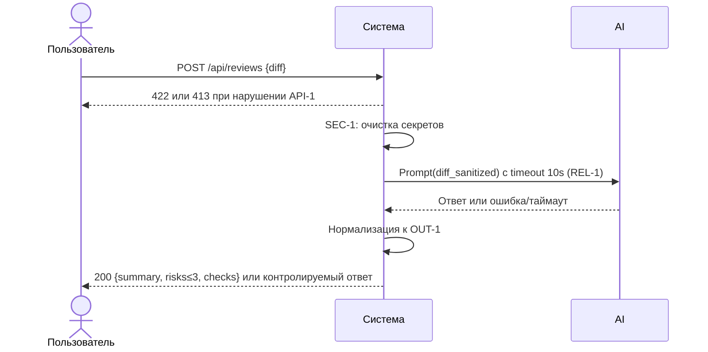

# Use cases и user stories

## Первый рабочий сценарий

Когда внутренняя CI-задача отправляет валидный PR-diff (≤20 000 символов) на POST /api/reviews, система валидирует тело, очищает секреты из diff, вызывает внешний LLM с таймаутом 10 секунд и возвращает структурированный ответ с summary, до тремя доказанными рисками и списком checks; пользователь получает предсказуемый JSON без 5xx.

Не входит в этот сценарий:

- Аутентификация и авторизация
- Любые действия в GitHub (approve/merge/комментарии)
- Изменение кода по советам AI

## Use case

| Поле | Значение |
|---|---|
| Актор | Внутренний разработчик или CI-бот |
| Триггер | Появился PR, CI формирует diff и вызывает POST /api/reviews |
| Предусловия | Доступен API сервиса; diff ≤ 20 000 символов; JSON валиден |
| Основной результат | 200 OK и тело {summary, risks≤3[file,line,evidence,risk], checks[]} по OUT-1 |
| Ошибка или отказ | 422 если нет поля diff или неверный тип; 413 если diff > 20 000; контролируемый ответ при таймауте/ошибке LLM |



## User stories и acceptance criteria

```gherkin
Feature: AI-ревью PR-диффов через API

  Scenario: Позитивный ответ на валидный diff
    Given доступен эндпоинт POST /api/reviews
      And существует валидный diff длиной 1000 символов
    When клиент отправляет JSON {"diff": "<diff>"}
    Then сервис отвечает 200
      And тело ответа содержит поля summary, risks и checks
      And массив risks содержит не более 3 элементов
      And у каждого риска есть поля file, line, evidence, risk

  Scenario: Негативный — отсутствует поле diff
    Given доступен эндпоинт POST /api/reviews
    When клиент отправляет пустой JSON {}
    Then сервис отвечает 422 Unprocessable Entity

  Scenario: Граничный — превышен лимит размера diff
    Given доступен эндпоинт POST /api/reviews
      And подготовлен diff длиной 20001 символ
    When клиент отправляет JSON {"diff": "<20001chars>"}
    Then сервис отвечает 413 Payload Too Large
```

## Как использовали AI

- Для чего: оформить первый рабочий сценарий, use case, диаграмму и Gherkin-критерии под правила SEC-1, API-1, REL-1, OUT-1
- Тип промпта: master prompt (P1-02)
- Строка в [`prompts.md`](prompts.md): P1-02
- Что проверили и исправили сами: связность шагов с TO BE; корректность синтаксиса Mermaid и Gherkin
