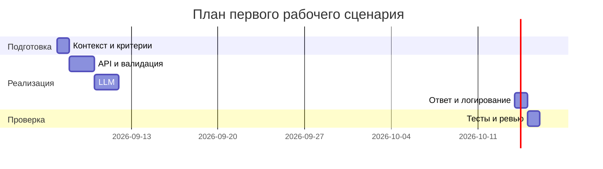

# План поставки

## Инкременты и ответственность

| Инкремент | Наблюдаемый результат | Что делает человек | Что делает AI или субагент | Проверка | Зависимости |
|---|---|---|---|---|---|
| 1. Контракт API и валидация | POST /api/reviews принимает JSON со схемой, отсутствие diff → 422; лимит 20 000 символов → 413 | Проектирует схему запроса и ответы, обновляет OpenAPI-описание | Генерирует тестовые примеры, проверяет граничные случаи | Интеграционные тесты 422/413, линтер схемы | CASE.md, TRAINING_PR.diff |
| 2. Безопасный и устойчивый вызов LLM | Очистка секретов (SEC-1); timeout 10s и контролируемая ошибка (REL-1) | Реализует функцию редактирования секретов и обработчики ошибок | Генерирует наборы секретов для юнит-тестов и заглушки LLM | Юнит-тесты редактирования; интеграция с заглушкой таймаута | Инкремент 1 |
| 3. Структурированный ответ и наблюдаемость | Ответ по OUT-1; логи по OBS-1 без чувствительных данных | Определяет сериализацию результата и поля логов | Генерирует примеры ответов, проверяет ≤3 риска и наличие полей | Юнит-тесты парсинга структуры; код-ревью логирования | Инкремент 2 |

## Диаграмма Ганта

Даты ориентировочные относительно учебного дедлайна.

## Как использовали AI

- Для чего: разложить поставку на проверяемые инкременты
- Тип промпта: master prompt (P1-02)
- Строка в [`prompts.md`](prompts.md): P1-02
- Что проверили и исправили сами: связность зависимостей и проверок; корректность Mermaid Gantt
